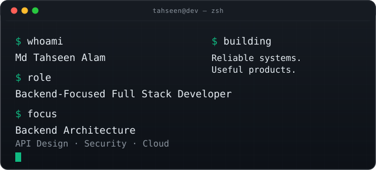
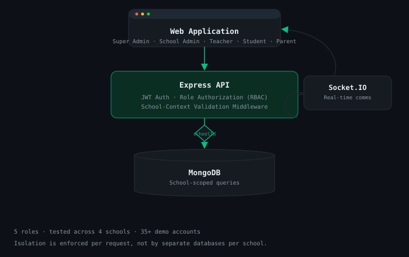
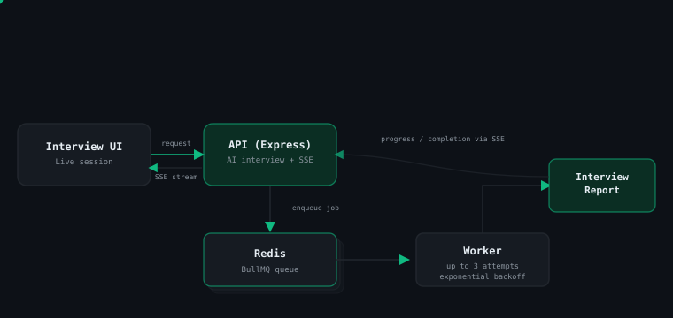
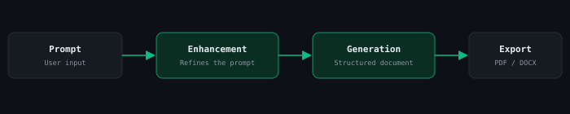

 

<!-- static fallback for the animation above, and for any renderer that doesn't show SVG animation -->
<code>$ whoami</code> → Md Tahseen Alam &nbsp;·&nbsp; <code>$ role</code> → Backend-Focused Full Stack Developer &nbsp;·&nbsp; <code>$ focus</code> → Backend Architecture · API Design · Security · Cloud

 

**Backend Focused Full Stack Developer** · Jaipur, India
Building reliable APIs, secure systems, and scalable web applications. I take a problem from initial requirements through to a working, deployed product with a particular interest in the parts of a system most people never see.

[Portfolio](https://tassu1.vercel.app/) · [GitHub](https://github.com/tassu1) · [LinkedIn](https://www.linkedin.com/in/md-tahseen-alam-892317263/) · [LeetCode](https://leetcode.com/u/tahseen_/) · [Email](mailto:tassutahsee@gmail.com)

## `01 /` What I work on

- Backend architecture and API design
- Authentication, authorization, and multi tenant systems
- Databases, caching, and background job processing
- Cloud deployment and production reliability

## `02 /` Selected work

### EduManage: Multi-tenant school management

A role based school management platform with school level data isolation, attendance, exams, timetables, and an AI tutor 5 roles, tested across 4 schools with 35+ demo accounts.

`React` `Node.js` `Express` `MongoDB` `Socket.IO` `JWT/RBAC` `OpenRouter`

> **How do you stop one school from seeing another's data?**
> Every protected route runs a school context check, and every query is filtered by `schoolId` shared database with enforced logical isolation, rather than a separate database per school. The tradeoff is that isolation depends on that filter being applied consistently everywhere, with no room for a missed check.

[Live demo](https://edumanageai.vercel.app/) · [Source](https://github.com/tassu1/edumanage)

---

### MockMate: AI interview platform

An interview practice tool where AI generated reports are handled asynchronously so the API never blocks on generation.

`Node.js` `Express` `Redis` `BullMQ` `SSE` `OpenRouter`

> **Why a background worker instead of generating the report in the request?**
> LLM report generation runs far longer than an HTTP cycle should hold open. A BullMQ queue on Redis hands the job to a separate worker (up to 3 attempts, exponential backoff), and progress streams back over SSE more moving parts, but the API stays responsive.

[Live demo](https://getmockmate.vercel.app/) · [Source](https://github.com/tassu1/mockmate)

---

### Lexica AI: AI document generation

Turns a single prompt into a structured, exportable document pitches, market analyses, synopses, proposals as PDF or DOCX.

`Next.js` `TypeScript` `NextAuth` `MongoDB` `OpenRouter`

> **How do you keep long-form generation from failing partway through?**
> One large prompt to document call is fragile and risks hitting token limits. The pipeline splits into a prompt enhancement pass and a separate generation pass, so a failure is cheaper to detect and retry at the cost of extra latency.

[Live demo](https://lexicaai.vercel.app/) · [Source](https://github.com/tassu1/Lexica)

---

### InnerLight: AI wellness companion

Mood tracking, journaling, and an AI companion (Lumi) in one app, with JWT-protected data per user and Cloudinary backed media storage.

`React` `Node.js` `Express` `MongoDB` `JWT` `Cloudinary`

> **Why split the client and API instead of one monolith?**
> It keeps app services, user data, and external media storage cleanly separated the tradeoff is handling CORS and environment config across two deployed pieces instead of one.

[Live demo](https://innerlightai.vercel.app/) · [Source](https://github.com/tassu1/innerlight)

## `03 /` GitHub activity

<!--
  These cards are rendered live by third-party services every time this page
  loads — they are not numbers typed into this file, and they update
  automatically with no workflow needed. See VERIFICATION.md for exactly
  what each metric includes and its known limitations.
-->

 
  

<!--START_SECTION:activity-->
<!-- This section is filled in automatically once the workflow runs. Leave it as-is. -->

## `04 /` Currently building

| Status | What |
|---|---|
| 🟢 EXPLORING | Backend architecture and system design patterns |
| 🟢 EXPLORING | Cloud infrastructure and production-readiness practices |
| 🟡 NEXT UP | `[Current project or feature]` |
| 🟡 NEXT UP | `[What I'm currently working on]` — `[Repository link]` |
| 🔵 IN PROGRESS | Continuing DSA practice (350+ solved so far) |

## `05 /` My toolkit

**Backend**  
Node.js · Express · TypeScript · REST APIs · JWT · RBAC · Socket.IO

**Data & infrastructure**  
MongoDB · PostgreSQL · Redis · BullMQ · Docker · AWS EC2/S3 · Vercel

**Frontend**  
React · Next.js · Redux · Tailwind CSS

**AI & integrations**  
OpenRouter API · NextAuth · Google OAuth · Cloudinary

## `06 /` How I think about engineering

I try to understand the problem before choosing the implementation — user needs, data boundaries, security, and where the system is likely to break, before writing code. Most of what I've built came out of a real constraint: keeping five schools' data apart on shared infrastructure, a queue that couldn't afford to block on AI generation, a document pipeline that had to survive a bad generation attempt. The edge cases are usually where the actual engineering is.

- 350+ problems solved across LeetCode and other platforms
- Branch Topper in my Diploma (82.17%)

## `07 /` Let's connect

Open to backend engineering and full-stack roles  reach out via [email](mailto:tassutahsee@gmail.com) or [LinkedIn](https://www.linkedin.com/in/md-tahseen-alam-892317263/).

